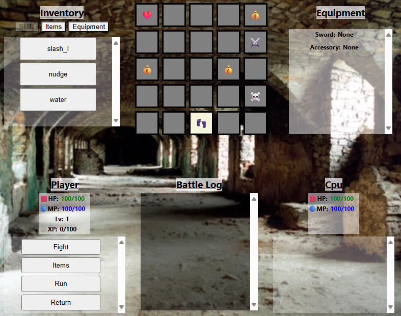

# **Notes on Red's Dungeon Crawler**
## Screenshot

# Name: **Red's Dungeon Crawler**
**Red's Dungeon Crawler** is a generic dungeon crawler. The main objective is to defeat the boss of the dungeon. Defeating the boss can be made easier by collecting extra items or leveling up.

I chose to make a dungeon crawler because I personally enjoy playing them. There are many dungeon-crawler clones out there, and some of them are quite popular. Some better-known dungeon crawlers include Final Fantasy III, Final Fantazy X, Cat Quest, Undertale, and South Park: The Stick of Truth.

# Instructions
**Red's Dungeon Crawler** can be played [here](https://red-dmacedo.github.io/pj-browser-based-dungeon-crawler/)

- Player Movement
  - The player always begins on the start square (25).
  - There is only one move to make at the start.
- Inventory
  - Skills Tab:
    - Displays skills you have acquired.
    - New skills are obtained by leveling up.
    - Selecting a skill in the inventory will do nothing
    - Hovering your mouse over a skill will give a short description of what it does.
  - Items Tab:
    - Displays items you own.
    - New items can be obtained by walking into a treasure room.
    - Selecting an item in the inventory tab will use that item immediately.
    - Hover your mouse over an item for a short description of what it does.
  - Equipment Tab:
    - Displays equipment you own.
    - New equipment can be obtained by entering a treasure room.
    - Equipment is not currently implemented.
    - Hover your mouse over a piece of equipment for a short description.

# Attributions
- Images used came from: [images.freeimages.com](https://images.freeimages.com).
- Emojis used came from: [getemoji.com](https://getemoji.com/)

# Technologies Used
- Javascript
  - Game logic.
  - Manipulation of the DOM.
- CSS
  - Styling the DOM.
- HTML
  - Served as a starting point for DOM manipulation.

# Next Steps
In the future I plan to accomplish the following:
1. Upgrade the battle system to work properly.
2. Implement equipment stats
3. Add map progression
    - When one boss is defeated, move to next floor
4. Dismantle the "Player" object and focus more on functions.